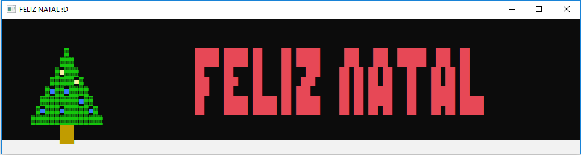
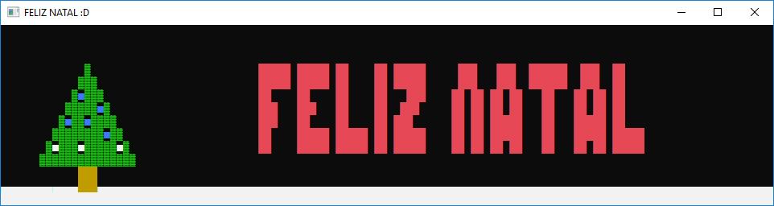

# Árvore de Natal com Interface Gráfica em C
Uma demonstração de forma simplificada das funções gráficas na linguagem C usando a biblioteca <windows.h> para desenhar uma árvore de natal com animação simples de cores.

**Palavras chave:** C, windows.h, Interface Gráfica

## Versões
VERSÃO 1.0.0 [25/12/2017]
* Versão inicial do programa
* Uso exclusivo da biblioteca <windows.h> para desenhar a interface

## Autores

* **Renan Zanoti** - *Primeiro projeto em C concluido envolvendo interface gráfica* - [renanzan](https://github.com/renanzan)
